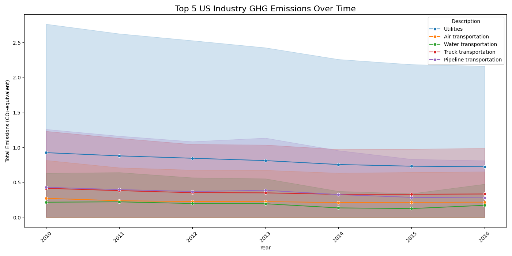

# 📘 GHG Emissions Analysis Project (Phase 1: 30% Completion)

## 🔰 Project Title:
**Analyzing Greenhouse Gas (GHG) Emissions Across US Industries**

---

## 📌 Objective:
To begin analyzing greenhouse gas emissions data by:
- Merging, cleaning, and standardizing raw emission factor datasets.
- Validating necessary columns for analysis.
- Identifying top-emitting industries.
- Creating a visual plot showing emission trends over time.

---

## 🧪 Phase 1 Tasks Completed:

### 1. Dataset Preprocessing
- Imported raw emissions dataset.
- Verified presence of required columns: `Description`, `Total Emissions`, `Year`.
- Handled missing data, renamed columns for consistency.

### 2. Data Merging & Cleaning
- Ensured structure matches expected format.
- Converted `Year` column to integer for time-series analysis.

### 3. Initial Analysis & Visualization
- Calculated total emissions by industry.
- Filtered top 5 industries with highest cumulative emissions.
- Plotted GHG trends using `matplotlib` and `seaborn`.

---

## 📊 Output:
✅ **top5_industries_emissions.png**  
A professional time-series line graph showing emission trends from the top 5 polluting industries.

---

## ⚙️ Tools & Technologies:
- Python
- Pandas
- Matplotlib
- Seaborn
- VSCode

---